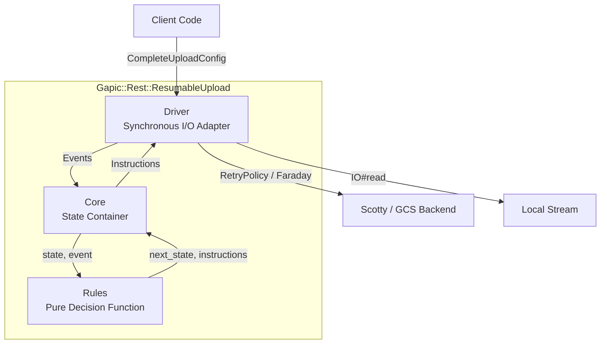

# Scotty Resumable Upload Protocol (RUP) Implementation Guide

## 1. System Architecture

The Resumable Upload Protocol (RUP) implementation in `gapic-common` is structured across three distinct tiers to separate network execution, protocol state progression, and state transition decision logic:



### 1.1 Driver (Synchronous I/O Adapter)
The `Driver` executes all operations with side-effects. It interacts with HTTP transport via `Gapic::Rest::ClientStub`, reads binary data from local input streams, tracks monotonic execution deadlines, and dispatches progress callbacks. 

Crucially, the Driver delegates all **Category 1 (Transient)** transport retries directly to `Gapic::Common::RetryPolicy`. Transient retries occur entirely within the Driver's network execution wrapper. The `Core` state machine is never exposed to transient noise, receiving only verified successful HTTP responses or terminal transport exceptions.

### 1.2 Core (State Container)
The `Core` maintains the immutable `State` snapshot. When `Core#dispatch(event)` is invoked by the Driver, Core forwards `@state`, the event, and static configuration to `Rules.step`. Core mutates `@state` to the returned next state and yields instructions back to the Driver. Core contains zero protocol branching logic and zero side effects.

### 1.3 Rules (Pure Decision Function)
The `Rules` module encapsulates the Resumable Upload Protocol state transitions as a pure functional module. Given a state snapshot, an input event, and configuration, `Rules.step` computes the next protocol state and emitted driver instructions.

### 1.4 Stream Buffering
Because arbitrary Ruby `IO` objects (network sockets, pipes, `STDIN`) do not support seeking (`#seek`), the Driver buffers the current in-flight chunk in memory (bounded by chunk size, default: 8MB). When `RetryPolicy` executes transport retries, or when `Core` triggers Category 2 recovery realignments within the buffered range, the Driver retransmits directly from memory. The buffer is discarded only after receiving a `200 OK` durably confirming receipt of the chunk.

---

## 2. Component Interfaces & Data Models

### 2.1 Client Configuration (`CompleteUploadConfig`)
```ruby
module Gapic
  module Rest
    module ResumableUpload
      CompleteUploadConfig = Data.define(
        :initial_url,                      # [String] Initial endpoint URI for session initiation
        :initial_body,                     # [String] Request payload for session initiation
        :initial_headers,                  # [Hash<String, String>] Additional headers for initiation
        :stream,                           # [IO] Binary input stream to upload
        :upload_size,                      # [Integer, nil] Total upload bytes if known upfront
        :chunk_size,                       # [Integer, nil] Explicit chunk size in bytes
        :content_type,                     # [String] MIME type of uploaded media
        :deadline,                         # [Numeric, nil] Absolute monotonic deadline in seconds (Process.clock_gettime(Process::CLOCK_MONOTONIC))
        :control_plane_retry_policy,       # [Gapic::Common::RetryPolicy, nil] Policy for start/query/cancel
        :data_plane_retry_policy,          # [Gapic::Common::RetryPolicy, nil] Policy for upload/finalize
        :user_override_start_retry_policy, # [Gapic::Common::RetryPolicy, nil] Optional user override for start command
        :on_progress                       # [Proc, nil] Callback: ->(bytes_uploaded, total_bytes)
      )
    end
  end
end
```

### 2.2 Protocol State (`State`)
```ruby
module Gapic
  module Rest
    module ResumableUpload
      State = Data.define(
        :status,             # [Symbol] :initializing, :starting, :transmission_reading, :transmission_sending,
                             #          :finalizing_sending_upload, :finalizing_sending_finalize,
                             #          :recovery, :cancelling, :cancelled, :success, :error, :rejected
        :upload_url,         # [String, nil] Session upload URL returned by Scotty backend
        :offset,             # [Integer] Contiguous bytes confirmed by server (protocol_state_offset)
        :chunk_size,         # [Integer] Resolved effective chunk size
        :chunk_granularity,  # [Integer, nil] Alignment modulus returned by server
        :in_flight_length,   # [Integer] Byte length of in-flight chunk currently being transmitted
        :last_error          # [StandardError, nil] Terminal exception
      ) do
      # def eql?, def hash etc
      end
    end
  end
end
```

### 2.3 Events Vocabulary (Driver -> Core)
*   `Event::StartUpload`: Start the upload session.
*   `Event::ChunkRead.new(bytes_buffered:, eof:)`: Binary data buffered in Driver memory; reports total bytes ready in buffer and whether the stream hit EOF.
*   `Event::HttpResponse.new(status:, headers:, body:)`: Dispatched for any completed HTTP exchange over the wire (including 2xx, 4xx, 5xx, or responses with missing/unexpected headers). `Core` inspects status and headers to determine protocol progression or recovery.
*   `Event::RequestFailed.new(kind:, message:, source_error:)`: Dispatched when an HTTP request fails to produce a usable HTTP response (e.g., transport connection errors or `RetryPolicy` exhaustion).
    *   `kind`: Normalized Symbol enum (`:retries_exhausted`, `:connection_failed`). `Core` branches on `kind` and treats other fields as opaque.
    *   `message`: Human-readable summary string.
    *   `source_error`: Original underlying exception, preserved for terminal error propagation and logging.
*   `Event::Cancel`: Caller requested session cancellation.
*   `Event::GlobalDeadlineExceeded`: Absolute monotonic clock exceeded `config.deadline`.

### 2.4 Instructions Vocabulary (Core -> Driver)
*   `Instruction::SendStart.new(url:, headers:, body:)`: Execute initiation request to establish upload session.
*   `Instruction::SendChunk.new(url:, offset:, length:, finalize:)`: Transmit buffered chunk of specified `length` starting at `offset`. If `finalize` is true, sends command `upload, finalize`.
*   `Instruction::SendFinalize.new(url:)`: Send standalone `finalize` command when all data bytes were already acknowledged.
*   `Instruction::SendQuery.new(url:)`: Query backend for current acknowledged offset (`query` command).
*   `Instruction::SendCancel.new(url:)`: Cancel upload session on server (`cancel` command).
*   `Instruction::RealignBuffer.new(server_offset:)`: Realign Driver in-memory buffer and stream position to match `server_offset`.
*   `Instruction::FillBuffer.new(target_bytesize:)`: Read from stream until in-memory buffer reaches `target_bytesize` bytes or stream encounters EOF.
*   `Instruction::NotifyProgress.new(bytes_uploaded:, total_bytes:)`: Invoke `on_progress` callback.
*   `Instruction::TerminateSuccess.new(response:)`: Upload finalized cleanly; return response.
*   `Instruction::TerminateFailure.new(error:)`: Raise terminal exception.

### 2.5 Driver Buffer Invariants & Stream Position Model

The Driver coordinates stream reading and in-memory buffering using four explicit offset markers:
*   `server_offset`: Contiguous byte count acknowledged by Scotty (extracted from `X-Goog-Upload-Size-Received`).
*   `protocol_state_offset`: Byte offset maintained in `State.offset`.
*   `buffer_start_offset`: Absolute stream offset corresponding to the first byte in the Driver's `@buffer`.
*   `buffer_end_offset`: `buffer_start_offset + @buffer.bytesize`.

```text
Stream Offset:   0 -----------------> buffer_start_offset -------------------> buffer_end_offset ----> (Stream EOF)
                                      |----------------- @buffer -------------|
                                                        ^
                                                  server_offset
```

#### Buffer Alignment Strategy (`Instruction::RealignBuffer`)
When `Core` resolves a recovery query or offset realignment, the Driver executes one of three alignment paths based on `server_offset`:

1.  **Case 1: Within Buffer Range (`buffer_start_offset <= server_offset <= buffer_end_offset`)**
    *   The required offset is already buffered in memory.
    *   Driver trims already-persisted bytes: `@buffer = @buffer.byteslice((server_offset - buffer_start_offset)..-1)`.
    *   Driver updates `buffer_start_offset = server_offset`.
    *   When subsequently executing `Instruction::FillBuffer(target_bytesize)`, Driver calculates `needed = target_bytesize - @buffer.bytesize` and reads only the missing difference from `stream` to complete the chunk to full `chunk_size` (unless stream reaches EOF).
2.  **Case 2: Server Offset Behind Buffer (`server_offset < buffer_start_offset`)**
    *   Occurs if the server rolls back beyond the retained buffer window.
    *   If `stream.respond_to?(:seek)`: Driver seeks the stream back to `server_offset`, resets `@buffer = "".b`, and sets `buffer_start_offset = server_offset`.
    *   If `stream` is unseekable (e.g. Socket, Pipe, STDIN): Driver raises a terminal `UnseekableStreamError` (Category 3 failure).
3.  **Case 3: Server Offset Ahead of Buffer (`server_offset > buffer_end_offset`)**
    *   Occurs when resuming an existing session or when the server processed a previously timed-out request ahead of local state.
    *   Driver resets `@buffer = "".b`.
    *   Driver advances the stream to `server_offset`:
        *   If seekable: `stream.seek(server_offset)`.
        *   If unseekable: Driver reads and discards `server_offset - current_stream_pos` bytes from `stream`.
    *   Driver sets `buffer_start_offset = server_offset`.

---

## 3. Component Architecture & Reference Implementation

The complete reference implementation for `Rules`, `Core`, and `Driver` is located in [reference-implementation.md](reference-implementation.md).

### 3.1 Rules Module (`Gapic::Rest::ResumableUpload::Rules`)
The `Rules` module is a pure functional transition engine with zero state awareness and zero side effects. It provides two primary entry points:
*   `Rules.shape_of(event)`: Classifies raw input events (`Event::StartUpload`, `Event::ChunkRead`, `Event::HttpResponse`, `Event::RequestFailed`, `Event::Cancel`, `Event::GlobalDeadlineExceeded`) into canonical symbols.
*   `Rules.step(state, event, config)`: Evaluates `case [state.status, shape]` pattern matching to compute the next state snapshot and emitted driver instructions (`[next_state, instructions]`).

Full implementation: [reference-implementation.md#1-rules-module](reference-implementation.md#1-rules-module)

### 3.2 Core Class (`Gapic::Rest::ResumableUpload::Core`)
The `Core` class is the state container holding the immutable `State` snapshot. It exposes:
*   `#state`: Reader for the current `State` snapshot.
*   `#dispatch(event)`: Invokes `Rules.step(@state, event, @config)`, updates `@state = next_state`, and returns the emitted instructions array to the Driver.

Full implementation: [reference-implementation.md#2-core-class](reference-implementation.md#2-core-class)

### 3.3 Driver Class (`Gapic::Rest::ResumableUpload::Driver`)
The `Driver` is the synchronous execution engine for the pure protocol state machine. When `Core#dispatch(event)` is invoked, it returns an ordered list (`Array<Instruction>`) of commands that the Driver executes in sequence.

#### Instruction Processing Semantics
The Driver categorizes instructions into three execution types:
1.  **Synchronous Side-Effects** (`NotifyProgress`, `RealignBuffer`):
    *   Executed immediately in-process.
    *   Do not yield a new `Event` and do not break the batch loop.
2.  **I/O & Network Operations** (`FillBuffer`, `SendStart`, `SendChunk`, `SendFinalize`, `SendQuery`, `SendCancel`):
    *   Execute physical stream reads or HTTP requests (wrapped in `Gapic::Common::RetryPolicy` for Category 1 transient errors).
    *   Yield a single resulting `Event` (`ChunkRead`, `HttpResponse`, or `RequestFailed`) that becomes the input for the next cycle.
3.  **Terminal Handlers** (`TerminateSuccess`, `TerminateFailure`):
    *   Break the event loop and return the final `Faraday::Response` or raise the terminal exception.

Full implementation: [reference-implementation.md#3-driver-class](reference-implementation.md#3-driver-class)

---

## 4. State Machine Protocol Rules

### 4.1 Upstream Protocol Contract
1.  **Logical Header Prefixing**: In the `start` request, logical headers describing the uploaded object must be prefixed with `X-Goog-Upload-Header-`. Specifically:
    *   `X-Goog-Upload-Header-Content-Type: config.content_type`
    *   `X-Goog-Upload-Header-Content-Length: config.upload_size` (if known upfront).
2.  **Offset Extraction**: On `query` responses, the acknowledged byte count is extracted from `X-Goog-Upload-Size-Received` as an integer (`server_offset`).
3.  **Request Modification on 4xx**: Retrying Category 2 errors requires querying the backend for `server_offset` first.
4.  **Standard Retry Configuration & Dual Policies**: The Driver manages two distinct retry policy configurations for Category 1 transient errors:
    *   **Control Plane Policy (`control_plane_retry_policy`)**: Applies to session control requests (`start`, `query`, `cancel`). Configured with standard retry codes (`["UNAVAILABLE", "DEADLINE_EXCEEDED", "RESOURCE_EXHAUSTED", "INTERNAL"]`) and network errors (`[Faraday::ConnectionFailed, Faraday::TimeoutError, SocketError]`). Missing `X-Goog-Upload-Status` header is treated as **retriable** (predicate returns `true`) to smooth over transient gateway/proxy stripped headers.
    *   **User Override for Start (`user_override_start_retry_policy`)**: If supplied by caller in `CompleteUploadConfig`, this policy overrides `control_plane_retry_policy` exclusively for the `start` command.
    *   **Data Plane Policy (`data_plane_retry_policy`)**: Applies to data transmission requests (`upload`, `upload,finalize`, and standalone `finalize`). Shares the identical standard retry configuration, but treats a missing `X-Goog-Upload-Status` header as **unretriable** (predicate returns `false`). This prevents blind chunk re-transmission and returns `Event::HttpResponse` immediately to `Core` so it can initiate Category 2 `Recovery`.

### 4.2 State Transition & Data Mutation Specification

**State Classification:**
* **Non-Terminal States**: `Initializing`, `Starting`, `Transmission | Reading from stream`, `Transmission | Sending`, `Finalizing | Sending with upload`, `Finalizing | Sending finalize`, `Recovery`, `Cancelling`.
* **Terminal States**: `Success`, `Cancelled`, `Error`, `Rejected`.

| From State | Event Shape | Event & Input Payload | State Mutations | To State | Emitted Instructions & Parameters |
| :--- | :--- | :--- | :--- | :--- | :--- |
| **`Initializing`** | `:start_upload` | `Event::StartUpload` | `status = :starting` | `Starting` | `Instruction::SendStart.new(url: config.initial_url, headers: config.initial_headers, body: config.initial_body)` |
| **`Starting`** | `:response_active` | `Event::HttpResponse(200, headers, _)` with `Status: active` | `upload_url = headers['X-Goog-Upload-URL']`<br/>`chunk_granularity = headers['...-Granularity']&.to_i`<br/>`chunk_size = resolve(config, chunk_granularity)`<br/>`offset = 0`<br/>`status = :transmission_reading` | `Transmission \| Reading from stream` | `Instruction::FillBuffer.new(target_bytesize: state.chunk_size)` |
| **`Starting`** | `:response_rejected` | `Event::HttpResponse(non-200, headers, _)` with `Status: final` | `status = :rejected` | `Rejected` | `Instruction::TerminateFailure.new(error: Gapic::Common::UploadRejectedError.new(response.body))` |
| **`Starting`** | `:response_cat2` / `:response_fatal_bad_response` | `Event::HttpResponse(4xx/5xx, _)` | `last_error = source_error`<br/>`status = :error` | `Error` | `Instruction::TerminateFailure.new(error: event.source_error)` |
| **`Starting`** | `:request_retries_exhausted` / `:request_connection_failed` | `Event::RequestFailed(kind:, message:, source_error:)` | `last_error = source_error`<br/>`status = :error` | `Error` | `Instruction::TerminateFailure.new(error: event.source_error)` |
| **`Transmission \| Reading from stream`** | `:chunk_read_full` | `Event::ChunkRead(bytes_buffered, eof: false)` | `in_flight_length = event.bytes_buffered`<br/>`status = :transmission_sending` | `Transmission \| Sending` | `Instruction::SendChunk.new(url: state.upload_url, offset: state.offset, length: event.bytes_buffered, finalize: false)` |
| **`Transmission \| Reading from stream`** | `:chunk_read_eof_with_data` | `Event::ChunkRead(bytes_buffered, eof: true)` where `bytes_buffered > 0` | `in_flight_length = event.bytes_buffered`<br/>`status = :finalizing_sending_upload` | `Finalizing \| Sending with upload` | `Instruction::SendChunk.new(url: state.upload_url, offset: state.offset, length: event.bytes_buffered, finalize: true)` |
| **`Transmission \| Reading from stream`** | `:chunk_read_eof_empty` | `Event::ChunkRead(bytes_buffered: 0, eof: true)` | `in_flight_length = 0`<br/>`status = :finalizing_sending_finalize` | `Finalizing \| Sending finalize` | `Instruction::SendFinalize.new(url: state.upload_url)` |
| **`Transmission \| Sending`** | `:response_active` | `Event::HttpResponse(200, headers, _)` with `Status: active` | `offset = state.offset + state.in_flight_length`<br/>`in_flight_length = 0`<br/>`status = :transmission_reading` | `Transmission \| Reading from stream` | `Instruction::NotifyProgress.new(bytes_uploaded: state.offset, total_bytes: config.upload_size)`<br/>`Instruction::FillBuffer.new(target_bytesize: state.chunk_size)` |
| **`Transmission \| Sending`** | `:response_cat2` | `Event::HttpResponse(status: 409\|416, ...)` or missing status header | `in_flight_length = 0`<br/>`status = :recovery` | `Recovery` | `Instruction::SendQuery.new(url: state.upload_url)` |
| **`Transmission \| Sending`** | `:request_retries_exhausted` / `:request_connection_failed` | `Event::RequestFailed(kind:, ...)` | `in_flight_length = 0`<br/>`status = :recovery` | `Recovery` | `Instruction::SendQuery.new(url: state.upload_url)` |
| **`Transmission \| Sending`** | `:response_rejected` | `Event::HttpResponse(non-200, headers, _)` with `Status: final` | `in_flight_length = 0`<br/>`status = :rejected` | `Rejected` | `Instruction::TerminateFailure.new(error: Gapic::Common::UploadRejectedError.new(response.body))` |
| **`Transmission \| Sending`** | `:response_fatal_bad_response` | `Event::HttpResponse(401/403/404, ...)` | `in_flight_length = 0`<br/>`last_error = event.source_error`<br/>`status = :error` | `Error` | `Instruction::TerminateFailure.new(error: event.source_error)` |
| **`Finalizing \| Sending with upload`** | `:response_final` | `Event::HttpResponse(200, headers, body)` with `Status: final` | `offset = state.offset + state.in_flight_length`<br/>`in_flight_length = 0`<br/>`status = :success` | `Success` | `Instruction::NotifyProgress.new(bytes_uploaded: state.offset, total_bytes: state.offset)`<br/>`Instruction::TerminateSuccess.new(response: event)` |
| **`Finalizing \| Sending with upload`** | `:response_cat2` | `Event::HttpResponse(status: 409\|416, ...)` or missing status header | `in_flight_length = 0`<br/>`status = :recovery` | `Recovery` | `Instruction::SendQuery.new(url: state.upload_url)` |
| **`Finalizing \| Sending with upload`** | `:request_retries_exhausted` / `:request_connection_failed` | `Event::RequestFailed(kind:, ...)` | `in_flight_length = 0`<br/>`status = :recovery` | `Recovery` | `Instruction::SendQuery.new(url: state.upload_url)` |
| **`Finalizing \| Sending with upload`** | `:response_rejected` | `Event::HttpResponse(non-200, headers, body)` with `Status: final` | `in_flight_length = 0`<br/>`status = :rejected` | `Rejected` | `Instruction::TerminateFailure.new(error: Gapic::Common::UploadRejectedError.new(response.body))` |
| **`Finalizing \| Sending with upload`** | `:response_fatal_bad_response` | `Event::HttpResponse(401/403/404, ...)` | `in_flight_length = 0`<br/>`last_error = event.source_error`<br/>`status = :error` | `Error` | `Instruction::TerminateFailure.new(error: event.source_error)` |
| **`Finalizing \| Sending finalize`** | `:response_final` | `Event::HttpResponse(200, headers, body)` with `Status: final` | `status = :success` | `Success` | `Instruction::TerminateSuccess.new(response: event)` |
| **`Finalizing \| Sending finalize`** | `:response_cat2` | `Event::HttpResponse(status: 409\|416, ...)` or missing status header | `status = :recovery` | `Recovery` | `Instruction::SendQuery.new(url: state.upload_url)` |
| **`Finalizing \| Sending finalize`** | `:request_retries_exhausted` / `:request_connection_failed` | `Event::RequestFailed(kind:, ...)` | `status = :recovery` | `Recovery` | `Instruction::SendQuery.new(url: state.upload_url)` |
| **`Finalizing \| Sending finalize`** | `:response_rejected` | `Event::HttpResponse(non-200, headers, body)` with `Status: final` | `status = :rejected` | `Rejected` | `Instruction::TerminateFailure.new(error: Gapic::Common::UploadRejectedError.new(response.body))` |
| **`Finalizing \| Sending finalize`** | `:response_fatal_bad_response` | `Event::HttpResponse(401/403/404, ...)` | `last_error = event.source_error`<br/>`status = :error` | `Error` | `Instruction::TerminateFailure.new(error: event.source_error)` |
| **`Recovery`** | `:response_active` | `Event::HttpResponse(200, headers, _)` with `Status: active` | `offset = headers['X-Goog-Upload-Size-Received'].to_i`<br/>`in_flight_length = 0`<br/>`status = :transmission_reading` | `Transmission \| Reading from stream` | `Instruction::RealignBuffer.new(server_offset: state.offset)`<br/>`Instruction::FillBuffer.new(target_bytesize: state.chunk_size)` |
| **`Recovery`** | `:response_final` | `Event::HttpResponse(200, headers, body)` with `Status: final` | `in_flight_length = 0`<br/>`status = :success` | `Success` | `Instruction::TerminateSuccess.new(response: event)` |
| **`Recovery`** | `:response_cat2` | `Event::HttpResponse(409/416/missing header)` | `status = :recovery` | `Recovery` | `Instruction::SendQuery.new(url: state.upload_url)` |
| **`Recovery`** | `:request_retries_exhausted` / `:request_connection_failed` | `Event::RequestFailed(kind:, ...)` | `last_error = event.source_error`<br/>`status = :error` | `Error` | `Instruction::TerminateFailure.new(error: event.source_error)` |
| **`Recovery`** | `:response_rejected` | `Event::HttpResponse(non-200, headers, body)` with `Status: final` | `status = :rejected` | `Rejected` | `Instruction::TerminateFailure.new(error: Gapic::Common::UploadRejectedError.new(response.body))` |
| **`Recovery`** | `:response_fatal_bad_response` | `Event::HttpResponse(401/403/404, ...)` | `last_error = source_error`<br/>`status = :error` | `Error` | `Instruction::TerminateFailure.new(error: event.source_error)` |
| **Any Non-Terminal** | `:user_cancel` | `Event::Cancel` | `status = :cancelling` | `Cancelling` | `Instruction::SendCancel.new(url: state.upload_url)` |
| **`Cancelling`** | `:response_cancelled` | `Event::HttpResponse(200, headers, _)` with `Status: cancelled` | `status = :cancelled` | `Cancelled` | `Instruction::TerminateFailure.new(error: Gapic::Common::UploadCancelledError.new)` |
| **`Cancelling`** | `:response_rejected` | `Event::HttpResponse(non-200, headers, _)` with `Status: final` | `status = :rejected` | `Rejected` | `Instruction::TerminateFailure.new(error: Gapic::Common::UploadRejectedError.new(event.body))` |
| **`Cancelling`** | `:request_retries_exhausted` / `:request_connection_failed` / `:response_fatal_bad_response` | `Event::RequestFailed` or HTTP failure | `status = :error` | `Error` | `Instruction::TerminateFailure.new(error: event.source_error)` |
| **Any Non-Terminal** | `:global_deadline_exceeded` | `Event::GlobalDeadlineExceeded` | `last_error = Gapic::Common::DeadlineExceededError.new`<br/>`status = :error` | `Error` | `Instruction::TerminateFailure.new(error: state.last_error)` |

### 4.3 State Transition Graph

```mermaid
stateDiagram-v2
    [*] --> Initializing
    Initializing --> Starting : Event::StartUpload
    Starting --> Transmission_Reading : Event::HttpResponse(200, active)
    
    state Transmission {
        Transmission_Reading --> Transmission_Sending : Event::ChunkRead(eof: false)
        Transmission_Sending --> Transmission_Reading : Event::HttpResponse(200, active)
    }
    
    Transmission_Reading --> Finalizing_Sending_Upload : Event::ChunkRead(eof: true, buffered > 0)
    Transmission_Reading --> Finalizing_Sending_Finalize : Event::ChunkRead(eof: true, buffered == 0)
    
    state Finalizing {
        Finalizing_Sending_Upload --> Success : Event::HttpResponse(200, final)
        Finalizing_Sending_Finalize --> Success : Event::HttpResponse(200, final)
    }
    
    Transmission_Sending --> Recovery : Event::HttpResponse(recoverable) / Event::RequestFailed
    Finalizing_Sending_Upload --> Recovery : Event::HttpResponse(recoverable) / Event::RequestFailed
    Finalizing_Sending_Finalize --> Recovery : Event::HttpResponse(recoverable) / Event::RequestFailed
    
    Recovery --> Transmission_Reading : Event::HttpResponse(200, active, server_offset)
    Recovery --> Success : Event::HttpResponse(200, final)
    
    Starting --> Rejected : Event::HttpResponse(non-200, final)
    Transmission_Sending --> Rejected : Event::HttpResponse(non-200, final)
    Finalizing_Sending_Upload --> Rejected : Event::HttpResponse(non-200, final)
    Finalizing_Sending_Finalize --> Rejected : Event::HttpResponse(non-200, final)
    Recovery --> Rejected : Event::HttpResponse(non-200, final)

    Starting --> Error : Event::RequestFailed / 4xx / 5xx
    Recovery --> Error : Event::RequestFailed
    
    Success --> [*]
    Rejected --> [*]
    Error --> [*]
```

---

## 5. Chunk Size Adjustment Rules

Upon receiving `200 OK` from the `start` request, `Core` inspects the response headers for `X-Goog-Upload-Chunk-Granularity`. The effective chunk size (`effective_chunk_size`) stored in `State` is resolved using the following variable definitions and rules:

### 5.1 Variable Definitions
*   `DEFAULT_CHUNK_SIZE`: Default chunk size of `8_388_608` bytes (8 MB).
*   `user_chunk_size`: Explicit chunk size specified in `CompleteUploadConfig.chunk_size` (or `nil` if unspecified).
*   `chunk_granularity`: Required byte alignment modulus parsed from header `X-Goog-Upload-Chunk-Granularity` as an Integer (or `nil` if header is absent).
*   `effective_chunk_size`: Final calculated byte size used by Driver for in-memory buffering and chunk transmission.

### 5.2 Resolution Rules

#### Rule 1: No Server Granularity Specified (`chunk_granularity` is nil or 0)
When the server does not specify a granularity requirement:
*   If `user_chunk_size` is provided: `effective_chunk_size = user_chunk_size`.
*   If `user_chunk_size` is omitted: `effective_chunk_size = DEFAULT_CHUNK_SIZE`.

#### Rule 2: Default Chunk Size with Server Granularity (`user_chunk_size` is nil, `chunk_granularity > 0`)
When the user does not specify a chunk size, the default 8 MB chunk size is aligned down to the nearest multiple of `chunk_granularity`:
*   `effective_chunk_size = DEFAULT_CHUNK_SIZE - (DEFAULT_CHUNK_SIZE % chunk_granularity)`.
*   If `DEFAULT_CHUNK_SIZE < chunk_granularity`, `effective_chunk_size` is promoted to `chunk_granularity`.

#### Rule 3: User Specified Chunk Size with Server Granularity (`user_chunk_size > 0`, `chunk_granularity > 0`)
When an explicit `user_chunk_size` is supplied alongside a server `chunk_granularity`:
*   **Case 3A (Standard Alignment: `user_chunk_size >= chunk_granularity`)**:
    *   The user chunk size is aligned down to the nearest integer multiple of `chunk_granularity`:
    *   `effective_chunk_size = user_chunk_size - (user_chunk_size % chunk_granularity)`.
    *   If `user_chunk_size` is already a multiple of `chunk_granularity` (`user_chunk_size % chunk_granularity == 0`), `effective_chunk_size = user_chunk_size`.
*   **Case 3B (User Size Below Granularity: `user_chunk_size < chunk_granularity`)**:
    *   If `user_chunk_size` is strictly less than `chunk_granularity`, downward alignment would produce `0` bytes (an invalid chunk size).
    *   To satisfy the server's mandatory granularity constraint, `effective_chunk_size` is promoted to `chunk_granularity`.

### 5.3 Reference Implementation
```ruby
def self.resolve_chunk_size(user_chunk_size, chunk_granularity)
  base_size = user_chunk_size || DEFAULT_CHUNK_SIZE
  return base_size if chunk_granularity.nil? || chunk_granularity <= 0
  return chunk_granularity if base_size <= chunk_granularity

  base_size - (base_size % chunk_granularity)
end
```

---

## 6. Error Classification & Recovery Flows

### 6.1 Error Categories
The implementation distinguishes three categories of network and protocol-level failures:

*   **Category 1: Transient Transport Failures**
    *   *Definition*: Standard TCP, network connection timeout, DNS, or server load-shedding errors that do not compromise the protocol session.
    *   *Examples*: `503 Service Unavailable`, `408 Request Timeout`, `429 Too Many Requests`, `Faraday::ConnectionFailed`, `Faraday::TimeoutError`.
    *   *Resolution*: The `Driver` intercepts these errors inside the physical execution wrapper and delegates directly to `Gapic::Common::RetryPolicy`. If retries succeed, `Core` receives `Event::HttpResponse`. If retries exhaust attempt/timeout limits, Driver emits `Event::RequestFailed(kind: :retries_exhausted, ...)`.
*   **Category 2: Recoverable Protocol Failures**
    *   *Definition*: Responses indicating that the client's current offset is misaligned with the server, missing mandatory protocol headers, or transport failures that exhausted Category 1 retries during data transmission.
    *   *Examples*: `409 Conflict`, `416 Range Not Satisfiable`, missing `X-Goog-Upload-Status` header on completed response, or `Event::RequestFailed` during `Transmission` / `Finalizing`.
    *   *Resolution*: Core transitions to `Recovery` and emits `Instruction::SendQuery` to obtain `server_offset`.
*   **Category 3: Terminal Failures**
    *   *Definition*: Irrecoverable errors where either the request is structurally invalid, unauthorized, unseekable rewind is needed, or the server has aborted the session.
    *   *Examples*: `400 Bad Request` (on `start`), `403 Forbidden`, `404 Not Found`, or any response where `X-Goog-Upload-Status` is `final` but returned a non-2xx status code (Rejection).
    *   *Resolution*: Core transitions to `:rejected` or `:error` and emits `Instruction::TerminateFailure`.

### 6.2 Recovery and Buffer Alignment
When `Core` resolves a `query` response in the `Recovery` state, it updates `State.offset` (`protocol_state_offset`) to `server_offset` (extracted from `X-Goog-Upload-Size-Received`) and transitions to `Transmission | Reading from stream`.

To realign the upload state, the `Driver` processes `Instruction::RealignBuffer(server_offset)` using its in-memory buffer and stream position tracking:
1.  **Within-Buffer Alignment (`buffer_start_offset <= server_offset <= buffer_end_offset`)**:
    *   The Driver trims already-persisted bytes: `@buffer = @buffer.byteslice((server_offset - buffer_start_offset)..-1)`.
    *   The Driver updates `buffer_start_offset = server_offset`.
    *   Upon executing the accompanying `Instruction::FillBuffer(target_bytesize)`, the Driver reads `target_bytesize - @buffer.bytesize` bytes from `stream` to restore `@buffer` to full `chunk_size` before transmitting.
2.  **Rewind Required (`server_offset < buffer_start_offset`)**:
    *   If `stream.respond_to?(:seek)`: the Driver seeks to `server_offset`, clears `@buffer = "".b`, and sets `buffer_start_offset = server_offset`.
    *   If `stream` is unseekable (e.g. Socket, Pipe, STDIN): the Driver raises terminal `UnseekableStreamError` (Category 3).
3.  **Fast-Forward Required (`server_offset > buffer_end_offset`)**:
    *   The Driver clears `@buffer = "".b`.
    *   If `stream.respond_to?(:seek)`: seeks to `server_offset`.
    *   If unseekable: reads and discards `server_offset - current_stream_pos` bytes from `stream`.
    *   The Driver sets `buffer_start_offset = server_offset`.

---

## 7. Observability Standards

When injecting optional loggers (`logger: nil`), utilities must use block syntax to prevent string formatting overhead when debug levels are disabled:
```ruby
@logger&.debug do
  "ResumableUpload::Driver: Transmitting chunk offset #{@core.state.offset} (effective size: #{@core.state.chunk_size})"
end
```