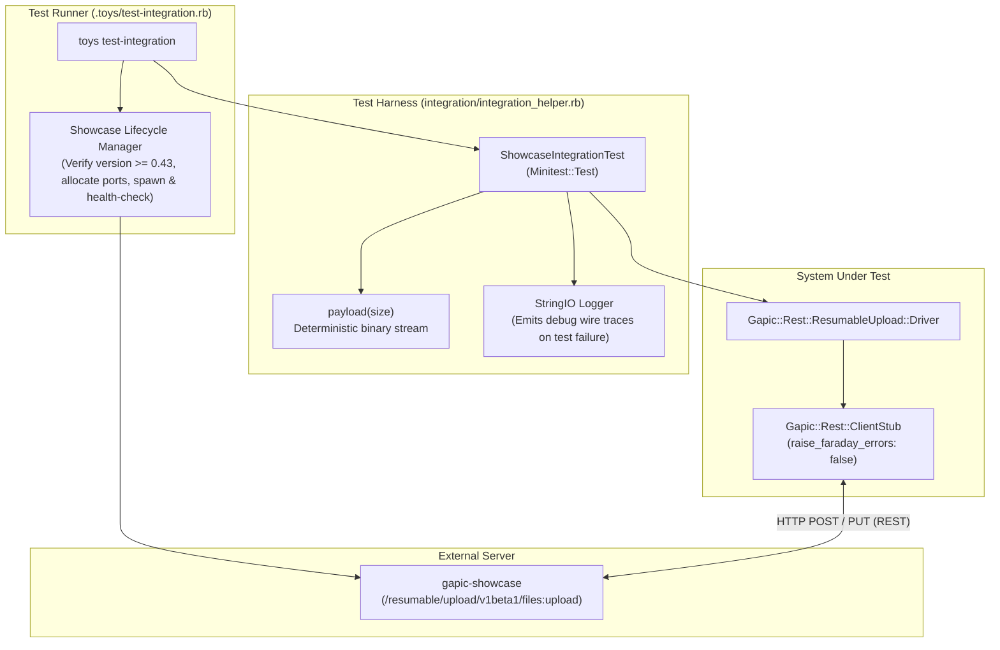

# Resumable Upload Integration Test Plan

This document outlines the integration test architecture and test suites for the Resumable Upload protocol implementation in `gapic-common`. Unlike the unit test suite ([test-plan.md](./test-plan.md)), which isolates protocol state transitions and driver components against test doubles, the integration test suite exercises the full stack end-to-end over real HTTP/REST connections against a live `gapic-showcase` server.

---

## 1. Integration Test Architecture Overview

### 1.1 Execution & Server Lifecycle (`.toys/test-integration.rb`)
* **External Endpoint Override**: If `SHOWCASE_ENDPOINT` is set in the environment, the runner connects directly to that address without spawning a local server.
* **Automatic Server Provisioning**: When `SHOWCASE_ENDPOINT` is unset, the runner locates the `gapic-showcase` binary on `PATH` (or via `SHOWCASE_BIN`), verifies that its version is at least `0.43`, allocates ephemeral ports, and spawns `gapic-showcase run`.
* **Health Check & Teardown**: Polls the TCP socket with a 10-second deadline before invoking Minitest, and guarantees process cleanup (`SIGTERM` + `waitpid`) in an `ensure` block.

### 1.2 Test Harness (`integration/integration_helper.rb`)
* **`ShowcaseIntegrationTest`**: Base class providing helper methods for test configuration:
  * `showcase_client_stub`: Instantiates a real `Gapic::Rest::ClientStub` targeting `SHOWCASE_ENDPOINT` with `raise_faraday_errors: false` and an attached `DEBUG` logger.
  * `build_config`: Creates a `CompleteUploadConfig` targeting `/resumable/upload/v1beta1/files:upload` with a default `on_progress` callback that appends every `Progress` struct to `@progress_records`.
  * `payload(size)`: Generates deterministic binary strings of arbitrary byte length for stream uploads.
  * **Diagnostic Trace Capture**: Buffers `DEBUG`-level driver logs in memory during each test run and dumps the full trace to `stderr` only if a test fails (or when `SHOWCASE_LOG` is set).

---

## 2. Detailed Test Suites & Cases

### 2.1 Golden Path Suite (`integration/resumable_upload/golden_path_test.rb`)

Tests standard, uninterrupted resumable upload workflows against `gapic-showcase`.

#### Case 1. Multi-chunk upload with known size (`test_multi_chunk_known_size`)
* **Scenario**: Uploads a 1.5 MB (`1_500_000` bytes) stream with an explicit `upload_size: 1_500_000` and `chunk_size: 524_288` (512 KiB).
* **Protocol Flow**:
  1. `start` command initiates the session with `X-Goog-Upload-Header-Content-Length: 1500000`.
  2. Chunk 1 transmits bytes `0..524287` (`upload`).
  3. Chunk 2 transmits bytes `524288..1048575` (`upload`).
  4. Chunk 3 transmits remaining bytes `1048576..1499999` with `upload, finalize`.
* **Assertions**:
  * Returned JSON body parses cleanly and reports `"size" == 1_500_000`.
  * `progress_records` contains exactly 3 `Progress` notifications matching cumulative byte offsets:
    * `Progress(bytes_uploaded: 524_288, total_bytes: 1_500_000)`
    * `Progress(bytes_uploaded: 1_048_576, total_bytes: 1_500_000)`
    * `Progress(bytes_uploaded: 1_500_000, total_bytes: 1_500_000)`

#### Case 2. Default chunk size on small upload (`test_small_upload_default_chunk_size`)
* **Scenario**: Uploads a ~100 KB (`100_000` bytes) payload with `upload_size: 100_000` and no `chunk_size` specified.
* **Protocol Flow**:
  1. `start` command initiates the session; chunk size defaults to 8 MiB (`8_388_608` bytes).
  2. The entire 100,000-byte payload fits within a single buffer read and is transmitted in one `upload, finalize` request.
* **Assertions**:
  * Returned JSON body reports `"size" == 100_000`.
  * `progress_records` contains exactly 1 `Progress` notification:
    * `Progress(bytes_uploaded: 100_000, total_bytes: 100_000)`
