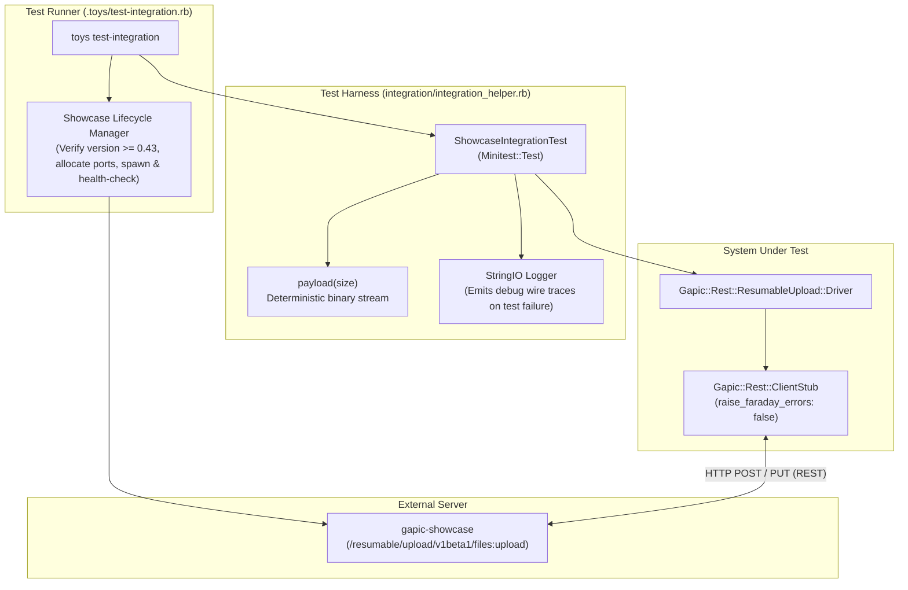

# Resumable Upload Integration Test Plan

This document outlines the integration test architecture and test suites for the Resumable Upload protocol implementation in `gapic-common`. Unlike the unit test suite ([test-plan.md](./test-plan.md)), which isolates protocol state transitions and driver components against test doubles, the integration test suite exercises the full stack end-to-end over real HTTP/REST connections against a live `gapic-showcase` server.

---

## 1. Integration Test Architecture Overview

### 1.1 Execution & Server Lifecycle (`.toys/test-integration.rb`)
* **External Endpoint Override**: If `SHOWCASE_ENDPOINT` is set in the environment, the runner connects directly to that address without spawning a local server.
* **Automatic Server Provisioning**: When `SHOWCASE_ENDPOINT` is unset, the runner locates the `gapic-showcase` binary on `PATH` (or via `SHOWCASE_BIN`), verifies that its version is at least `0.43`, allocates ephemeral ports, and spawns `gapic-showcase run`.
* **Health Check & Teardown**: Polls the TCP socket with a 10-second deadline before invoking Minitest, and guarantees process cleanup (`SIGTERM` + `waitpid`) in an `ensure` block.

### 1.2 Test Harness (`integration/integration_helper.rb`)
* **`ShowcaseIntegrationTest`**: Base class providing helper methods for test configuration:
  * `showcase_client_stub`: Instantiates a real `Gapic::Rest::ClientStub` targeting `SHOWCASE_ENDPOINT` with `raise_faraday_errors: false` and an attached `DEBUG` logger.
  * `build_config(scenario: nil, scenario_config: {}, **overrides)`: Creates a `CompleteUploadConfig` targeting `/resumable/upload/v1beta1/files:upload`. When `scenario` is provided, injects `X-Goog-Test-Scenario` and `X-Goog-Test-Scenario-Config` (with a generated `client_uuid` merged with `scenario_config`) into `initial_headers`. Configures fast retry policies (`FAST_RETRY = { initial_delay: 0.01, max_delay: 0.05, multiplier: 1, timeout: 2 }`), a default 10-second session timeout, a default payload of `786_432` bytes (`3 * 262_144`), default chunk size of `262_144` bytes, and an `on_progress` callback appending each `Progress` struct to `@progress_records`.
  * `phases` & `offsets`: Convenience accessors returning `@progress_records.map(&:phase)` and `@progress_records.map(&:bytes_uploaded)`.
  * `payload(size)`: Generates deterministic binary strings of arbitrary byte length for stream uploads.
  * `UnseekableStream`: Stream wrapper around `StringIO` that exposes `#read` and `#pos` while omitting `#seek` (`respond_to?(:seek)` is `false`).
  * **Diagnostic Trace Capture**: Buffers `DEBUG`-level driver logs in memory during each test run and dumps the full trace to `stderr` only if a test fails (or when `SHOWCASE_LOG` is set).

---

## 2. Detailed Test Suites & Cases

### 2.1 Golden Path Suite (`integration/resumable_upload/golden_path_test.rb`)

Tests standard, uninterrupted resumable upload workflows against `gapic-showcase`.

#### Case 1. Multi-chunk upload with known size (`test_multi_chunk_known_size`)
* **Scenario**: Uploads a 1.5 MB (`1_500_000` bytes) stream with an explicit `upload_size: 1_500_000` and `chunk_size: 524_288` (512 KiB).
* **Protocol Flow**:
  1. `start` command initiates the session with `X-Goog-Upload-Header-Content-Length: 1500000`.
  2. Chunk 1 transmits bytes `0..524287` (`upload`).
  3. Chunk 2 transmits bytes `524288..1048575` (`upload`).
  4. Chunk 3 transmits remaining bytes `1048576..1499999` with `upload, finalize`.
* **Assertions**:
  * Returned JSON body parses cleanly and reports `"size" == 1_500_000`.
  * `progress_records` contains 6 `Progress` notifications across lifecycle phases:
    * `Progress(phase: :initiating, bytes_uploaded: 0, total_bytes: 1_500_000)`
    * `Progress(phase: :uploading, bytes_uploaded: 0, total_bytes: 1_500_000)`
    * `Progress(phase: :uploading, bytes_uploaded: 524_288, total_bytes: 1_500_000)`
    * `Progress(phase: :uploading, bytes_uploaded: 1_048_576, total_bytes: 1_500_000)`
    * `Progress(phase: :finalizing, bytes_uploaded: 1_048_576, total_bytes: 1_500_000)`
    * `Progress(phase: :completed, bytes_uploaded: 1_500_000, total_bytes: 1_500_000)`

#### Case 2. Default chunk size on small upload (`test_small_upload_default_chunk_size`)
* **Scenario**: Uploads a ~100 KB (`100_000` bytes) payload with `upload_size: 100_000` and no `chunk_size` specified.
* **Protocol Flow**:
  1. `start` command initiates the session; chunk size defaults to 8 MiB (`8_388_608` bytes).
  2. The entire 100,000-byte payload fits within a single buffer read and is transmitted in one `upload, finalize` request.
* **Assertions**:
  * Returned JSON body reports `"size" == 100_000`.
  * `progress_records` contains 4 `Progress` notifications:
    * `Progress(phase: :initiating, bytes_uploaded: 0, total_bytes: 100_000)`
    * `Progress(phase: :uploading, bytes_uploaded: 0, total_bytes: 100_000)`
    * `Progress(phase: :finalizing, bytes_uploaded: 0, total_bytes: 100_000)`
    * `Progress(phase: :completed, bytes_uploaded: 100_000, total_bytes: 100_000)`

#### Case 3. Standalone finalize on unseekable stream (`test_standalone_finalize_unseekable_stream`)
* **Scenario**: Uploads a `786_432`-byte payload (`3 * 262_144` bytes) wrapped in an `UnseekableStream`, with `chunk_size: 262_144` (256 KiB) and `upload_size` omitted (`nil`).
* **Coverage**:
  * Unknown total upload size on `start` (omitted `X-Goog-Upload-Header-Content-Length`).
  * End-of-exact-boundary stream reading path (payload is an exact multiple of `chunk_size`, so EOF is not detected until the subsequent buffer fill).
  * Standalone `SendFinalize` instruction (`upload_command: "finalize"` with empty body).
* **Protocol Flow**:
  1. `start` command initiates the session without a total content length header.
  2. Chunk 1 transmits bytes `0..262143` (`upload`).
  3. Chunk 2 transmits bytes `262144..524287` (`upload`).
  4. Chunk 3 transmits bytes `524288..786431` (`upload`).
  5. Next buffer read returns 0 bytes at EOF (`:chunk_read_eof_empty`), emitting `SendFinalize` to send a standalone `finalize` request at offset `786432`.
* **Assertions**:
  * Returned JSON body reports `"size" == 786_432`.
  * `progress_records` contains 7 `Progress` notifications:
    * `Progress(phase: :initiating, bytes_uploaded: 0, total_bytes: nil)`
    * `Progress(phase: :uploading, bytes_uploaded: 0, total_bytes: nil)`
    * `Progress(phase: :uploading, bytes_uploaded: 262_144, total_bytes: nil)`
    * `Progress(phase: :uploading, bytes_uploaded: 524_288, total_bytes: nil)`
    * `Progress(phase: :uploading, bytes_uploaded: 786_432, total_bytes: nil)`
    * `Progress(phase: :finalizing, bytes_uploaded: 786_432, total_bytes: nil)`
    * `Progress(phase: :completed, bytes_uploaded: 786_432, total_bytes: 786_432)`

### 2.2 Chunk Granularity Suite (`integration/resumable_upload/chunk_granularity_test.rb`)

Tests dynamic chunk size resolution when the server mandates a byte alignment modulus via `X-Goog-Upload-Chunk-Granularity`.

#### Case 1. Downward alignment to server granularity (`test_chunk_granularity_alignment`)
* **Scenario**: Uploads a `1_000_000`-byte payload with `scenario: "chunk_granularity"`, an explicit unaligned user `chunk_size: 300_000`, and `timeout: 5`.
* **Protocol Flow**:
  1. `start` command initiates the session; Showcase returns `X-Goog-Upload-Chunk-Granularity: 256`.
  2. Client resolves the effective chunk size down to the nearest multiple of 256: `300_000 - (300_000 % 256) = 299_776` bytes.
  3. Chunks 1, 2, and 3 transmit `299_776` bytes each (`upload`), advancing confirmed offsets to `299_776`, `599_552`, and `899_328`.
  4. Final chunk transmits the remaining `100_672` bytes (`899_328..999_999`) with `upload, finalize`.
* **Assertions**:
  * Returned JSON body reports `"size" == 1_000_000`.
  * `offsets` equals `[0, 0, 299_776, 599_552, 899_328, 899_328, 1_000_000]`.
  * `phases` equals `[:initiating, :uploading, :uploading, :uploading, :uploading, :finalizing, :completed]`.

