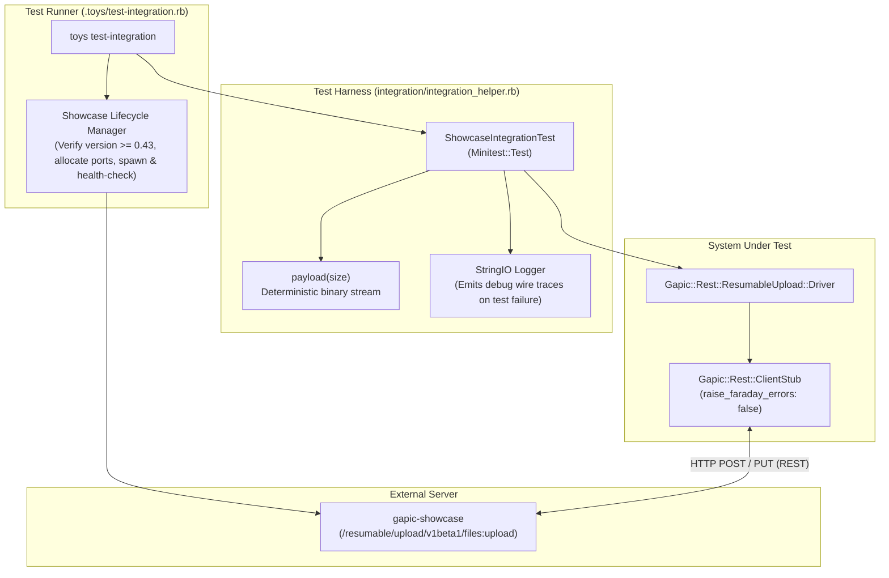

# Resumable Upload Integration Test Plan

This document outlines the integration test architecture and test suites for the Resumable Upload protocol implementation in `gapic-common`. Unlike the unit test suite ([test-plan.md](./test-plan.md)), which isolates protocol state transitions and driver components against test doubles, the integration test suite exercises the full stack end-to-end over real HTTP/REST connections against a live `gapic-showcase` server.

---

## 1. Integration Test Architecture Overview

### 1.1 Execution & Server Lifecycle (`.toys/test-integration.rb`)
* **External Endpoint Override**: If `SHOWCASE_ENDPOINT` is set in the environment, the runner connects directly to that address without spawning a local server.
* **Automatic Server Provisioning**: When `SHOWCASE_ENDPOINT` is unset, the runner locates the `gapic-showcase` binary on `PATH` (or via `SHOWCASE_BIN`), verifies that its version is at least `0.43`, allocates ephemeral ports, and spawns `gapic-showcase run`.
* **Health Check & Teardown**: Polls the TCP socket with a 10-second deadline before invoking Minitest, and guarantees process cleanup (`SIGTERM` + `waitpid`) in an `ensure` block.

### 1.2 Test Harness (`integration/integration_helper.rb`)
* **`ShowcaseIntegrationTest`**: Base class providing helper methods for test configuration:
  * `showcase_client_stub`: Instantiates a real `Gapic::Rest::ClientStub` targeting `SHOWCASE_ENDPOINT` with `raise_faraday_errors: false` and an attached `DEBUG` logger.
  * `build_config(scenario: nil, scenario_config: {}, **overrides)`: Creates a `CompleteUploadConfig` targeting `/resumable/upload/v1beta1/files:upload`. When `scenario` is provided, injects `X-Goog-Test-Scenario` and `X-Goog-Test-Scenario-Config` (with a generated `client_uuid` merged with `scenario_config`) into `initial_headers`. Configures fast retry policies (`FAST_RETRY = { initial_delay: 0.01, max_delay: 0.05, multiplier: 1, timeout: 2 }`), a default 10-second session timeout, a default payload of `786_432` bytes (`3 * 262_144`), default chunk size of `262_144` bytes, and an `on_progress` callback appending each `Progress` struct to `@progress_records`.
  * `phases` & `offsets`: Convenience accessors returning `@progress_records.map(&:phase)` and `@progress_records.map(&:bytes_uploaded)`.
  * `payload(size)`: Generates deterministic binary strings of arbitrary byte length for stream uploads.
  * `UnseekableStream`: Stream wrapper around `StringIO` that exposes `#read` and `#pos` while omitting `#seek` (`respond_to?(:seek)` is `false`).
  * **Diagnostic Trace Capture**: Buffers `DEBUG`-level driver logs in memory during each test run and dumps the full trace to `stderr` only if a test fails (or when `SHOWCASE_LOG` is set).

---

## 2. Detailed Test Suites & Cases

### 2.1 Golden Path Suite (`integration/resumable_upload/golden_path_test.rb`)

Tests standard, uninterrupted resumable upload workflows against `gapic-showcase`.

#### Case 1. Multi-chunk upload with known size (`test_multi_chunk_known_size`)
* **Scenario**: Uploads a 1.5 MB (`1_500_000` bytes) stream with an explicit `upload_size: 1_500_000` and `chunk_size: 524_288` (512 KiB).
* **Protocol Flow**:
  1. `start` command initiates the session with `X-Goog-Upload-Header-Content-Length: 1500000`.
  2. Chunk 1 transmits bytes `0..524287` (`upload`).
  3. Chunk 2 transmits bytes `524288..1048575` (`upload`).
  4. Chunk 3 transmits remaining bytes `1048576..1499999` with `upload, finalize`.
* **Assertions**:
  * Returned JSON body parses cleanly and reports `"size" == 1_500_000`.
  * `progress_records` contains 6 `Progress` notifications across lifecycle phases:
    * `Progress(phase: :initiating, bytes_uploaded: 0, total_bytes: 1_500_000)`
    * `Progress(phase: :uploading, bytes_uploaded: 0, total_bytes: 1_500_000)`
    * `Progress(phase: :uploading, bytes_uploaded: 524_288, total_bytes: 1_500_000)`
    * `Progress(phase: :uploading, bytes_uploaded: 1_048_576, total_bytes: 1_500_000)`
    * `Progress(phase: :finalizing, bytes_uploaded: 1_048_576, total_bytes: 1_500_000)`
    * `Progress(phase: :completed, bytes_uploaded: 1_500_000, total_bytes: 1_500_000)`

#### Case 2. Default chunk size on small upload (`test_small_upload_default_chunk_size`)
* **Scenario**: Uploads a ~100 KB (`100_000` bytes) payload with `upload_size: 100_000` and no `chunk_size` specified.
* **Protocol Flow**:
  1. `start` command initiates the session; chunk size defaults to 8 MiB (`8_388_608` bytes).
  2. The entire 100,000-byte payload fits within a single buffer read and is transmitted in one `upload, finalize` request.
* **Assertions**:
  * Returned JSON body reports `"size" == 100_000`.
  * `progress_records` contains 4 `Progress` notifications:
    * `Progress(phase: :initiating, bytes_uploaded: 0, total_bytes: 100_000)`
    * `Progress(phase: :uploading, bytes_uploaded: 0, total_bytes: 100_000)`
    * `Progress(phase: :finalizing, bytes_uploaded: 0, total_bytes: 100_000)`
    * `Progress(phase: :completed, bytes_uploaded: 100_000, total_bytes: 100_000)`

#### Case 3. Standalone finalize on unseekable stream (`test_standalone_finalize_unseekable_stream`)
* **Scenario**: Uploads a `786_432`-byte payload (`3 * 262_144` bytes) wrapped in an `UnseekableStream`, with `chunk_size: 262_144` (256 KiB) and `upload_size` omitted (`nil`).
* **Coverage**:
  * Unknown total upload size on `start` (omitted `X-Goog-Upload-Header-Content-Length`).
  * End-of-exact-boundary stream reading path (payload is an exact multiple of `chunk_size`, so EOF is not detected until the subsequent buffer fill).
  * Standalone `SendFinalize` instruction (`upload_command: "finalize"` with empty body).
* **Protocol Flow**:
  1. `start` command initiates the session without a total content length header.
  2. Chunk 1 transmits bytes `0..262143` (`upload`).
  3. Chunk 2 transmits bytes `262144..524287` (`upload`).
  4. Chunk 3 transmits bytes `524288..786431` (`upload`).
  5. Next buffer read returns 0 bytes at EOF (`:chunk_read_eof_empty`), emitting `SendFinalize` to send a standalone `finalize` request at offset `786432`.
* **Assertions**:
  * Returned JSON body reports `"size" == 786_432`.
  * `progress_records` contains 7 `Progress` notifications:
    * `Progress(phase: :initiating, bytes_uploaded: 0, total_bytes: nil)`
    * `Progress(phase: :uploading, bytes_uploaded: 0, total_bytes: nil)`
    * `Progress(phase: :uploading, bytes_uploaded: 262_144, total_bytes: nil)`
    * `Progress(phase: :uploading, bytes_uploaded: 524_288, total_bytes: nil)`
    * `Progress(phase: :uploading, bytes_uploaded: 786_432, total_bytes: nil)`
    * `Progress(phase: :finalizing, bytes_uploaded: 786_432, total_bytes: nil)`
    * `Progress(phase: :completed, bytes_uploaded: 786_432, total_bytes: 786_432)`

### 2.2 Chunk Granularity Suite (`integration/resumable_upload/chunk_granularity_test.rb`)

Tests dynamic chunk size resolution when the server mandates a byte alignment modulus via `X-Goog-Upload-Chunk-Granularity`.

#### Case 1. Downward alignment to server granularity (`test_chunk_granularity_alignment`)
* **Scenario**: Uploads a `1_000_000`-byte payload with `scenario: "chunk_granularity"`, an explicit unaligned user `chunk_size: 300_000`, and `timeout: 5`.
* **Protocol Flow**:
  1. `start` command initiates the session; Showcase returns `X-Goog-Upload-Chunk-Granularity: 256`.
  2. Client resolves the effective chunk size down to the nearest multiple of 256: `300_000 - (300_000 % 256) = 299_776` bytes.
  3. Chunks 1, 2, and 3 transmit `299_776` bytes each (`upload`), advancing confirmed offsets to `299_776`, `599_552`, and `899_328`.
  4. Final chunk transmits the remaining `100_672` bytes (`899_328..999_999`) with `upload, finalize`.
* **Assertions**:
  * Returned JSON body reports `"size" == 1_000_000`.
  * `offsets` equals `[0, 0, 299_776, 599_552, 899_328, 899_328, 1_000_000]`.
  * `phases` equals `[:initiating, :uploading, :uploading, :uploading, :uploading, :finalizing, :completed]`.

### 2.3 Error Recovery Suite (`integration/resumable_upload/error_recovery_test.rb`)

Tests Category 1 transient transport retries and Category 2 protocol recovery workflows against `scenario: "non_fatal_error_on_chunk_upload"`.

#### Case 1. Category 1 transient error retried transparently (`test_cat1_error_retried_transparently`)
* **Scenario**: Injects a single `503 Service Unavailable` response at offset `0` (`error_code: 503, failure_count: 1, after_offset: 0`).
* **Protocol Flow**:
  1. `start` establishes the session (`200 active`).
  2. First attempt to upload chunk 1 (`0..262143`) receives `503`.
  3. `Driver` intercepts the transient error via `data_plane_retry_policy` (`FAST_RETRY`) and retries the chunk transparently without entering protocol `Recovery`.
  4. Subsequent chunks and standalone `finalize` succeed normally.
* **Assertions**:
  * Returned JSON body reports `"size" == 786_432`.
  * `phases` does not include `:recovering` (`[:initiating, :uploading, :uploading, :uploading, :uploading, :finalizing, :completed]`).
  * `offsets` equals `[0, 0, 262_144, 524_288, 786_432, 786_432, 786_432]`.

#### Case 2. Simple Category 2 error recovery at offset 0 (`test_simple_cat2_error_recovery`)
* **Scenario**: Injects a single `409 Conflict` with `X-Goog-Upload-Status: active` at offset `0` (`error_code: 409, failure_count: 1, after_offset: 0`).
* **Protocol Flow**:
  1. First upload chunk receives `409` (`:response_cat2`).
  2. `Core` transitions to `Recovery` (`:recovering`) and issues `SendQuery`.
  3. Server responds with `X-Goog-Upload-Size-Received: 0`; client realigns buffer to offset `0`, retransmits chunk 1, and completes the upload.
* **Assertions**:
  * Returned JSON body reports `"size" == 786_432`.
  * `phases` equals `[:initiating, :uploading, :recovering, :uploading, :uploading, :uploading, :uploading, :finalizing, :completed]`.
  * `offsets` equals `[0, 0, 0, 0, 262_144, 524_288, 786_432, 786_432, 786_432]`.

#### Case 3. Two consecutive Category 2 recoveries on chunk 2 (`test_two_consecutive_cat2_recoveries_on_chunk_2`)
* **Scenario**: Injects two consecutive `409` errors at offset `262_144` (`error_code: 409, failure_count: 2, after_offset: 262_144`).
* **Protocol Flow**:
  1. Chunk 1 (`0..262143`) succeeds.
  2. First attempt at chunk 2 (`262144..524287`) fails with `409` -> `:recovering` -> `query` (offset `262_144`) -> `:uploading`.
  3. Second attempt at chunk 2 fails with `409` -> `:recovering` -> `query` (offset `262_144`) -> `:uploading`.
  4. Third attempt at chunk 2 succeeds; chunk 3 and `finalize` complete normally.
* **Assertions**:
  * Returned JSON body reports `"size" == 786_432`.
  * `phases` equals `[:initiating, :uploading, :uploading, :recovering, :uploading, :recovering, :uploading, :uploading, :uploading, :finalizing, :completed]`.
  * `offsets` equals `[0, 0, 262_144, 262_144, 262_144, 262_144, 262_144, 524_288, 786_432, 786_432, 786_432]`.

#### Case 4. Category 2 failure on finalizing chunk (`test_cat2_failure_on_finalizing_chunk`)
* **Scenario**: Uploads a `786_332`-byte payload (`3 * 262_144 - 100`) where chunk 3 (`524288..786331`) carries `upload, finalize`, injecting a `409` error at offset `524_288` (`error_code: 409, failure_count: 1, after_offset: 524_288`).
* **Protocol Flow**:
  1. Chunks 1 and 2 succeed, advancing offset to `524_288`.
  2. Client enters `:finalizing` and transmits chunk 3 with `upload, finalize`.
  3. Server returns `409` (`:response_cat2`); client transitions from `:finalizing` to `:recovering`, queries server (`X-Goog-Upload-Size-Received: 524288`), realigns buffer, re-enters `:finalizing`, and retransmits `upload, finalize` to completion.
* **Assertions**:
  * Returned JSON body reports `"size" == 786_332`.
  * `phases` equals `[:initiating, :uploading, :uploading, :uploading, :finalizing, :recovering, :uploading, :finalizing, :completed]`.
  * `offsets` equals `[0, 0, 262_144, 524_288, 524_288, 524_288, 524_288, 524_288, 786_332]`.

#### Case 5. Repeated no-header failures until global deadline exceeded (`test_no_headers_failure_recovers_until_deadline_exceeded`)
* **Scenario**: Configures `failure_count: 0, action_after_failures: "terminate"` with a 1-second session `timeout`.
* **Protocol Flow**:
  1. Server responds to every upload chunk with HTTP `500` and no `X-Goog-Upload-Status` header.
  2. `data_plane_retry_policy` treats missing `X-Goog-Upload-Status` as unretriable (`predicate` returns `false`), yielding `Event::HttpResponse(500)` to `Core`.
  3. `Core` classifies the response as Category 2 (`:response_cat2`), enters `:recovering`, queries the server (which returns `200 active` at offset `0`), and retries the upload.
  4. This recovery loop repeats until the 1-second global session deadline expires and `Driver#run` raises `Gapic::Rest::ResumableUpload::DeadlineExceededError`.
* **Assertions**:
  * Raises `Gapic::Rest::ResumableUpload::DeadlineExceededError`.
  * `phases.count(:recovering) >= 2`.

### 2.4 Error on Start Suite (`integration/resumable_upload/error_on_start_test.rb`)

Tests non-fatal transient retries, missing status headers, retry exhaustion, fatal errors, and session isolation during the session initiation (`start`) phase. Uses a 100-byte payload, configuring `FAST_RETRY` for non-exhaustion retry cases to minimize test execution latency while retaining default policies for exhaustion and fatal checks.

#### Case 1. Non-fatal transient error on start (`test_non_fatal_error_on_start_503`)
* **Scenario**: Injects a single `503 Service Unavailable` on the initial `start` request (`scenario: "non_fatal_error_on_start"`, `error_code: 503, failure_count: 1`, `start_retry_policy: FAST_RETRY`).
* **Protocol Flow**:
  1. First `start` POST request receives `503`.
  2. `start_retry_policy` transparently retries the initiation request.
  3. Second attempt succeeds (`200 active`), returning session URL.
  4. 100-byte upload completes normally.
* **Assertions**:
  * Returned JSON body reports `"size" == 100`.
  * Exactly 1 `:initiating` notification in `phases` (`phases.count(:initiating) == 1`).
  * `phases.last == :completed`.

#### Case 2. Missing status header / 400 on start (`test_missing_header_retriable_on_start_400`)
* **Scenario**: Injects a single `400 Bad Request` without an `X-Goog-Upload-Status` header on `start` (`scenario: "non_fatal_error_on_start"`, `error_code: 400, failure_count: 1`, `start_retry_policy: FAST_RETRY`).
* **Protocol Flow**:
  1. First `start` POST request receives `400` with no upload status header.
  2. `START_PREDICATE` identifies the missing status header on start as retriable (for non-fatal status codes) and retries the initiation request.
  3. Second attempt succeeds (`200 active`).
  4. 100-byte payload is transmitted and finalized.
* **Assertions**:
  * Returned JSON body reports `"size" == 100`.
  * `phases.count(:initiating) == 1`.
  * `phases.last == :completed`.

#### Case 3. Retry exhaustion and session deadline on start (`test_retry_exhaustion_on_start_times_out`)
* **Scenario**: Injects repeated `503 Service Unavailable` responses (`failure_count: 10_000`) with default start retry policy and a 3-second session `timeout` (`scenario: "non_fatal_error_on_start"`).
* **Protocol Flow**:
  1. `start` command encounters continuous 503 errors.
  2. Client retries with default exponential backoff until the 3-second global session deadline expires.
  3. Client terminates failure before entering transmission.
* **Assertions**:
  * Raises a `Gapic::Common::Error` (`BadResponseError` or `DeadlineExceededError`).
  * Total elapsed time is close to 3 seconds (`2.5s <= elapsed <= 6.0s`, accounting for default backoff delays and network latency).
  * `phases` contains no `:uploading` entries (`refute_includes phases, :uploading`).

#### Case 4. Fatal errors on start (`test_fatal_error_on_start_raises_bad_response_immediately`)
* **Scenario**: Injects fatal HTTP status codes (`403 Forbidden` and `404 Not Found`) on `start` (`scenario: "fatal_error_on_start"`).
* **Protocol Flow**:
  1. Initial `start` request receives a fatal status code (`403` or `404`).
  2. `START_PREDICATE` refutes retry on fatal status codes (`Rules::FATAL_STATUS_CODES`).
  3. `Driver#execute_send_start` returns the fatal response directly to `Core`.
  4. `Rules` classifies the response as `:response_fatal_bad_response` and emits `:fail_with_bad_response`.
  5. Session terminates immediately with `BadResponseError`.
* **Assertions**:
  * Raises `Gapic::Rest::ResumableUpload::BadResponseError` with error message containing the HTTP status code.
  * Elapsed time is < 0.5s, confirming zero retries were attempted.
  * Refutes any `:uploading` phases.

#### Case 5. Sequential session isolation (`test_sequential_runs_session_isolation`)
* **Scenario**: Executes two sequential upload runs under Case 1 (`non_fatal_error_on_start`, 503, failure_count: 1, `start_retry_policy: FAST_RETRY`) with distinct client UUIDs.
* **Protocol Flow**:
  1. First run executes and succeeds.
  2. Second run executes with a newly generated `client_uuid` and independent progress tracking.
* **Assertions**:
  * Both runs successfully complete uploading 100 bytes.
  * Demonstrates Showcase session state isolation across sequential client sessions.

