# Resumable Upload Test Plan

This document outlines the complete unit and integration test plan for the Resumable Upload protocol implementation in `gapic-common`. It details all test suites, systems under test (SUT), test doubles, test cases, and behavioral assertions added across the protocol layers.

---

## 1. Test Architecture Overview

```mermaid
flowchart TD
    subgraph TestSuites["Test Suites"]
        RC["rules_classification_test.rb<br/>(Rules Classification & Utility)"]
        RT["rules_test.rb<br/>(Rules Progression & Lifecycle)"]
        RR["rules_recovery_test.rb<br/>(Rules Recovery Transitions)"]
        RE["rules_error_test.rb<br/>(Rules Terminal Errors & Formatting)"]
        RP["retry_policies_test.rb<br/>(Retry Policies & Header Extraction)"]
        DB["driver_buffer_test.rb<br/>(Stream Buffering & Realignment)"]
        DE["driver_error_mapping_test.rb<br/>(Network Error Mapping)"]
        DP["driver_progress_test.rb<br/>(Progress Dispatch & Error Propagation)"]
        DT["driver_test.rb<br/>(Driver Upload Execution Loop)"]
        DR["driver_retry_test.rb<br/>(Driver Initiation & Query Retries)"]
        DC["driver_config_test.rb<br/>(Driver Configuration & Deadlines)"]
        AB["driver/abridge_test.rb<br/>(Payload & Header Redaction)"]
        UL["driver/upload_log_test.rb<br/>(UploadLog Structured Entries)"]
        DL["driver_logging_test.rb<br/>(Driver Logging & Corpus Invariants)"]
    end

    subgraph SUT["Systems Under Test"]
        RulesClassify["Rules.shape_of<br/>Rules.classify_http_response<br/>Rules.header_value<br/>Rules.resolve_chunk_size"]
        RulesStep["Rules.step<br/>Rules.fail_with_unmatched_transition"]
        Policies["RetryPolicies.default_start<br/>RetryPolicies.default_control_plane<br/>RetryPolicies.default_data_plane<br/>RetryPolicies.extract_headers"]
        DriverIO["Driver#execute_fill_buffer<br/>Driver#execute_realign_buffer"]
        DriverErr["Driver#rescue_request_error<br/>Driver#rescue_faraday_error"]
        DriverProg["Driver#execute_notify_progress"]
        DriverRun["Driver#run<br/>Driver#execute_send_chunk"]
        DriverRetry["Driver#execute_send_start<br/>Driver#execute_send_query"]
        DriverConfig["Driver#resolve_timeout<br/>Driver#deadline_exceeded?"]
        DriverLog["Driver::Abridge<br/>Driver::UploadLog<br/>Driver#run Logging"]
    end

    RC --> RulesClassify
    RT --> RulesStep
    RR --> RulesStep
    RE --> RulesStep
    RP --> Policies
    DB --> DriverIO
    DE --> DriverErr
    DP --> DriverProg
    DT --> DriverRun
    DR --> DriverRetry
    DC --> DriverConfig
    AB --> DriverLog
    UL --> DriverLog
    DL --> DriverLog
```

---

## 2. Test Doubles & Fixtures

| Double Name | Location | Description & Behavior |
| :--- | :--- | :--- |
| `ChunkedStream` | `driver_buffer_test.rb` | Wraps `StringIO`; caps returned bytes per `#read(length)` call to simulate socket/pipe short reads. |
| `UnseekableStream` | `driver_buffer_test.rb` | Wraps `StringIO` with `#read` but explicitly omits `#seek` (`respond_to?(:seek)` is `false`). |
| `FailingClientStub` | `driver_error_mapping_test.rb` | Integration fake client stub configured with `@error_to_raise` to verify exception rescue in `Driver#make_post_request`. |
| `ScriptedClientStub` | `driver_progress_test.rb` / `driver_test.rb` | Yields a deterministic sequence of HTTP response structs and records dispatched requests. |
| `RecordingLogger` | `test_helper.rb` | Real `Logger` at `DEBUG` level whose formatter appends every emitted `Google::Logging::Message` and severity to an in-memory array. Ensures log blocks execute completely rather than being stubbed out (catching any exceptions inside log blocks that `StubLogger#log` would otherwise rescue). |
| `FakeStub` | `driver_logging_test.rb` | Returns scripted HTTP responses and records `method_name` arguments passed to `make_post_request`. |

---

## 3. Detailed Test Suites & Cases

### 3.1 Rules Classification & Utility (`rules_classification_test.rb`)

#### A. Case-Insensitive Header Extraction (`Rules.header_value`)
* **Exact match**: Exact key casing (`"X-Goog-Upload-Status"` $\rightarrow$ `"active"`).
* **Key case-insensitivity**: Resolves lowercase (`"x-goog-upload-status"`), uppercase (`"X-GOOG-UPLOAD-STATUS"`), and mixed-case (`"x-Goog-UpLoad-Status"`).
* **Symbol keys**: Resolves symbols in headers hash (`:"x-goog-upload-status"`).
* **Missing or non-hash input**: Returns `nil` when key is absent, or when headers object is `nil`, `[]`, or a String.

#### B. HTTP Response Classification (`Rules.classify_http_response`)
* **`active` status header**:
  * HTTP 200 + `active` (and casing variants `"Active"`, `"ACTIVE"`, `"aCtIvE"`) $\rightarrow$ `:response_active`.
  * Non-200 (HTTP 503, 500, 400, 408) + `active` $\rightarrow$ `:response_cat2`.
* **`final` status header**:
  * HTTP 200 + `final` (and casing variants `"Final"`, `"FINAL"`) $\rightarrow$ `:response_final`.
  * Non-200 (HTTP 400, 404, 500) + `final` $\rightarrow$ `:response_rejected`.
* **`cancelled` status header**:
  * HTTP 200 + `cancelled` (and casing variants `"Cancelled"`, `"CANCELLED"`) $\rightarrow$ `:response_cancelled`.
  * Non-200 (HTTP 400, 500) + `cancelled` $\rightarrow$ `:response_fatal_bad_response`.
* **Missing or empty status header (`nil`, `""`)**:
  * HTTP 200 without status header $\rightarrow$ `:response_cat2`.
  * All 7 recoverable status codes (`400, 408, 409, 412, 416, 429, 499`) without status header $\rightarrow$ `:response_cat2`.
  * 5xx server/gateway errors (`500, 502, 503, 504`) without status header $\rightarrow$ `:response_cat2`.
  * All 7 fatal status codes (`401, 403, 404, 405, 410, 413, 415`) without status header or with empty status header $\rightarrow$ `:response_fatal_bad_response`.
* **Unknown status header values**:
  * Non-standard status strings (`"absconded"`, `"pending"`, `"in_progress"`, `"error"`, `"unknown"`) with HTTP 200 or 400 $\rightarrow$ `:response_fatal_bad_response`.
* **Header key variations**:
  * Correct classification regardless of key casing (`"x-goog-upload-status"`, `"X-GOOG-UPLOAD-STATUS"`, `:"x-goog-upload-status"`).

#### C. Event Shape Classification (`Rules.shape_of`)
* **Control events**: `Event::StartUpload`, `Event::Cancel`, `Event::GlobalDeadlineExceeded` as instances and class singletons.
* **Stream chunk reads**: Full chunks (`:chunk_read_full`), EOF with remaining data (`:chunk_read_eof_with_data`), EOF empty (`:chunk_read_eof_empty`).
* **Transport failures**: Retries exhausted (`:request_retries_exhausted`), connection failures (`:request_connection_failed`), unknown/other kinds (`:request_failed_unknown`).
* **HTTP responses**: Delegates cleanly to `classify_http_response`.
* **Unrecognized objects**: Arbitrary objects (`Object.new`, `nil`, `"string"`) $\rightarrow$ `:unknown`.

#### D. Chunk Size Negotiation (`Rules.resolve_chunk_size`)
* **`nil`, `0`, or negative granularity**: Preserves user-specified chunk size or falls back to `DEFAULT_CHUNK_SIZE` (`8_388_608`) without modulo errors.
* **Evenly divisible**: Preserves chunk size when user size or default size divides server granularity evenly.
* **Not divisible (downward alignment)**: Rounds down to the nearest multiple of granularity (e.g. 1000 with granularity 256 $\rightarrow$ 768; 10 MB with 256 KB $\rightarrow$ 9,961,472 bytes; default 8 MB with 500 KB $\rightarrow$ 8 MB).
* **Equal size**: Preserves chunk size when size equals granularity (256 and 256 $\rightarrow$ 256).
* **Granularity strictly greater than chunk size**: Promotes chunk size to granularity to avoid rounding down to 0 (e.g. 100 with granularity 256 $\rightarrow$ 256; 1 with 256 KB $\rightarrow$ 256 KB; default 8 MB with 16 MB $\rightarrow$ 16 MB).

---

### 3.2 Rules State Machine (`rules_test.rb`, `rules_recovery_test.rb`, `rules_error_test.rb`)

#### A. Normal Progression & Session Lifecycle (`rules_test.rb`)
* **Session initiation**: `:initializing` on `:start_upload` transitions to `:starting` and emits `Instruction::SendStart`.
* **Transmission start**: `:starting` on `:response_active` resolves chunk size and granularity, transitions to `:transmission_reading`, and emits `Instruction::FillBuffer`.
* **Chunk transmission & finalization**: `:transmission_reading` dispatches `SendChunk` (with or without `finalize: true`) or standalone `SendFinalize` depending on stream EOF and buffered bytes.
* **Chunk acknowledgment**: `:transmission_sending` on `:response_active` advances offset, emits `NotifyProgress`, `RealignBuffer`, and `FillBuffer`.
* **Cancellation flow**: `:user_cancel` transitions to `:cancelling` and emits `SendCancel`; `:response_cancelled` transitions to `:cancelled`.

#### B. Protocol Recovery Transitions (`rules_recovery_test.rb`)
* **Entering recovery**: `:transmission_sending` (on `:response_cat2`, `:request_connection_failed`, `:request_timeout`) and `:finalizing_sending_upload` (on `:request_timeout`) transition to `:recovery` and emit `Instruction::SendQuery`.
* **Realignment from recovery**: `:recovery` on `:response_active` updates offset from `X-Goog-Upload-Size-Received`, emits `RealignBuffer` and `FillBuffer`, and transitions to `:transmission_reading`.
* **Finalized in recovery**: `:recovery` on `:response_final` transitions to `:success` and emits `TerminateSuccess`.
* **Retrying recovery query**: `:recovery` on `:response_cat2` remains in `:recovery` and re-emits `SendQuery`.

#### C. Terminal Failures & Actionable Error Formatting (`rules_error_test.rb`)
* **Terminal failures (`:rejected` / `:error`)**:
  * Session rejection (`:response_rejected` $\rightarrow$ `UploadRejectedError`), fatal bad responses (`:response_fatal_bad_response` $\rightarrow$ `BadResponseError`).
  * Non-recoverable request failures: `:request_retries_exhausted` in `:transmission_sending`, and `:request_timeout` in `:starting` or `:recovery`.
  * Global deadline expiration: `:global_deadline_exceeded` $\rightarrow$ `DeadlineExceededError`.
* **Actionable description on unexpected HTTP response**:
  * Unmatched event (HTTP 200 `Status: final` while in `:transmission_sending`) raises `InvalidTransitionError` with human phrasing (`"Resumable upload failed while sending a chunk of data: received an unexpected HTTP 200 response (X-Goog-Upload-Status: 'final')."`) and attaches `err.response`, `err.event`, `err.state`.
* **Missing status header formatting in error**:
  * Unexpected response lacking `X-Goog-Upload-Status` formats header description as `(X-Goog-Upload-Status: missing)`.
* **Actionable description for non-HTTP unexpected events**:
  * Stream chunk read while in `:starting` raises message stating `"initiating upload session: received unexpected stream chunk read (512 bytes, eof: false)"` with `err.response == nil`.

---

### 3.3 Driver Stream Buffering & Realignment (`driver_buffer_test.rb`)

#### A. Stream Reading (`Driver#execute_fill_buffer`)
* **Short reads**: `ChunkedStream` returning at most 20 bytes per read call repeatedly accumulates until buffer hits target 100 bytes (`bytes_buffered: 100, eof: false`).
* **EOF at target boundary**: Stream with exactly 100 bytes for a 100-byte target stops reading once target is satisfied; `eof` remains `false` until subsequent read.
* **EOF mid-fill**: Stream with 45 bytes for a 100-byte target detects EOF, returns `bytes_buffered: 45, eof: true`, and stores 45 bytes in buffer.
* **Empty stream**: 0-byte stream returns `bytes_buffered: 0, eof: true` with empty buffer.

#### B. Buffer Realignment (`Driver#execute_realign_buffer`)
* **Trim within buffer**:
  * *Exact beginning*: `server_offset` matching buffer start leaves buffer intact.
  * *Middle*: `server_offset` in middle slices buffer and updates start offset.
  * *Exact end*: `server_offset` at end empties buffer and updates start offset.
* **Rewind stream**:
  * *Seekable*: Rewinds stream position and resets buffer to target offset.
  * *Unseekable*: Raises `UnseekableStreamError` with target and current buffer offsets in message.
* **Fast-forward stream**:
  * *Seekable*: Seeks stream forward and resets buffer to target offset.
  * *Unseekable*: Reads and discards needed bytes from stream to advance to target offset.

---

### 3.4 Driver Network Error Mapping (`driver_error_mapping_test.rb`)

* **`Driver#rescue_request_error`**:
  * `Gapic::Rest::DeadlineExceededError` $\rightarrow$ `Event::RequestFailed(kind: :timeout)` preserving error message and `source_error`.
  * `Gapic::Rest::Error` with HTTP status code $\rightarrow$ `Event::HttpResponse(status:, headers:, body:)`.
  * `Gapic::Rest::Error` without status code $\rightarrow$ `Event::RequestFailed(kind: :connection_failed)`.
  * `StandardError` (`RuntimeError`) $\rightarrow$ `Event::RequestFailed(kind: :connection_failed)`.
* **`Driver#rescue_faraday_error`**:
  * `Faraday::Error` with response hash $\rightarrow$ `Event::HttpResponse(status: 400, headers:, body:)`.
  * `Faraday::TimeoutError` $\rightarrow$ `Event::RequestFailed(kind: :timeout)`.
  * `Faraday::ConnectionFailed` $\rightarrow$ `Event::RequestFailed(kind: :connection_failed)`.
  * Generic `Faraday::Error` without response $\rightarrow$ `Event::RequestFailed(kind: :retries_exhausted)`.
* **Integration verification**: All mappings verified both directly and end-to-end through `Driver#make_post_request` via `FailingClientStub`.

---

### 3.5 Retry Policies & Header Extraction (`retry_policies_test.rb`)

#### A. Header Extraction (`RetryPolicies.extract_headers`)
* Extracts from `#headers`, `#response_headers`, and Faraday `#response[:headers]`. Returns `nil` when no headers present.

#### B. $3 \times 3$ Policy Matrix (`policy.retry_error?`)
| Policy | Headers Present, NO Upload-Status | Headers Present, WITH Upload-Status | NO Headers |
| :--- | :--- | :--- | :--- |
| **`default_start`** | **Retried unconditionally** (`true`) across 503, 400, 200, empty string header, and no error code. | **Falls back to codes**: retries 503; refutes 400 and no code. | **Falls back to codes**: retries 503; refutes 400 and no code. |
| **`default_control_plane`** | **Falls back to codes**: retries 503; refutes 400 and no code. | **Falls back to codes**: retries 503; refutes 400 and no code. | **Falls back to codes**: retries 503; refutes 400 and no code. |
| **`default_data_plane`** | **Unretriable** (`false`) across 503, 400, empty string header, and no code (triggers Cat 2 recovery). | **Falls back to codes**: retries 503; refutes 400 and no code. | **Falls back to codes**: retries 503; refutes 400 and no code. |

---

### 3.6 Progress Notification Dispatching (`driver_progress_test.rb`)

* **Safe no-op without callback**: `on_progress: nil` executes without raising.
* **Happy path**: Callback receives a `Progress` instance containing `bytes_uploaded` and `total_bytes` once per instruction.
* **Pass-through of `total_bytes: nil`**: `total_bytes` passed as `nil` when upload size is unspecified.
* **Unswallowed callback error propagation**: Exceptions raised within `on_progress` are not swallowed or caught; they immediately propagate to the caller in both `execute_notify_progress` and `Driver#run`.

---

### 3.7 Driver Upload Execution Loop (`driver_test.rb`)

* **Multi-chunk upload**: Multi-chunk stream uploads with active status headers succeed and return the final response body String.
* **Protocol recovery during chunk upload**: Missing status header on chunk response triggers `query` recovery and resumes chunk transmission from the server-confirmed offset.

---

### 3.8 Driver Initiation & Query Retries (`driver_retry_test.rb`)

* **Session initiation retry loop**: Missing status header on HTTP 200 during `start` triggers `start_retry_policy` and succeeds upon header arrival.
* **Initiation retry exhaustion**: Continuous missing status headers on `start` exhaust retries and dispatch `Event::RequestFailed(kind: :retries_exhausted)`.
* **Control plane non-retry**: Missing status header on `query` does not retry inside `execute_send_query`, returning `Event::HttpResponse` immediately to drive protocol recovery.

---

### 3.9 Driver Configuration & Deadlines (`driver_config_test.rb`)

* **Explicit positive timeout precedence**: `resolve_timeout` returns `config.timeout` when strictly positive.
* **Zero or negative timeout handling**: Zero or negative `config.timeout` is treated the same as `nil` (unset), falling back to size-based or `BASE_TIMEOUT` resolution.
* **Size-proportional timeout above base floor**: Large `upload_size` computes timeout as `upload_size.fdiv(MIN_ASSUMED_THROUGHPUT)`.
* **Base timeout floor for small uploads**: Small `upload_size` floors at `BASE_TIMEOUT` (`3_600` seconds).
* **Default base timeout when size is nil**: Unspecified `upload_size` defaults to `BASE_TIMEOUT`.
* **Deadline expiration enforcement**: Monotonic clock exceeding `@deadline` during `Driver#run` triggers `Event::GlobalDeadlineExceeded` and raises `Gapic::Common::DeadlineExceededError`.

---

### 3.10 Payload & Header Abridgement (`driver/abridge_test.rb`)

* **Binary payload hex encoding & abridgement (`Driver::Abridge.bytes`)**:
  * `nil` returns `nil`; short payloads (< 64 bytes, including 63-byte boundary) are full-hex-encoded via `unpack1("H*")`.
  * Payloads $\ge 64$ bytes are abridged to the first 32 bytes in hex followed by total byte size (`"<32-byte hex>... <100 bytes>"`).
* **Error body sanitization (`Driver::Abridge.error_body`)**:
  * Truncates error response strings to at most 512 bytes.
  * Forces UTF-8 encoding and scrubs invalid byte sequences (`\xFF\xFE`) so malformed error payloads never raise encoding errors during log serialization.
* **URL query parameter elision (`Driver::Abridge.url`)**:
  * Parses URIs and replaces every query parameter value with `<...>` (`uploadType=<...>&sid=<...>`) so capability session IDs never leak into logs.
* **Header allowlisting (`Driver::Abridge.headers`)**:
  * Preserves values for headers prefixed with `x-goog-upload-` (case-insensitive) and abridges URLs in `x-goog-upload-url`.
  * Redacts all other headers (`Authorization`, `Content-Type`, custom metadata) to `"<...>"`.
* **Instruction summarization (`Driver::Abridge.instructions`)**:
  * Summarizes emitted instruction structs (`SendStart`, `SendChunk`) into hashes with abridged URLs and metadata while omitting raw request body payloads.

---

### 3.11 Structured Upload Log Helper (`driver/upload_log_test.rb`)

* **Bijective recipe coverage (`test_lifecycle_table_matches_rules_recipes`)**:
  * Verifies that `UploadLog::LIFECYCLE.keys + UploadLog::SILENT_RECIPES` equals `Rules::RECIPES` with zero unmapped recipes and zero overlap between active and silent lists.
* **State machine decision logging (`UploadLog#decision`)**:
  * Emits `DEBUG` entries containing `uploadId`, `fromStatus`, `shape`, `recipe`, `toStatus`, `offset`, `inFlightLength`, and abridged `instructions`.
* **Lifecycle milestone logging (`UploadLog#lifecycle`)**:
  * Emits `INFO` entries for session milestones (`:start_session` with `uploadSize` and `requestedChunkSize`), `DEBUG` for per-chunk transmission (`:send_chunk`), and `WARN` for terminal failures (`:fail_with_rejected` with `error` field).
  * Asserts silent recipes (`:ignore_duplicate_cancel`, `:ack_chunk`) emit no lifecycle log entries.
* **Wire trace logging (`wire_send`, `wire_receive`, `wire_failure`)**:
  * `wire_send` logs `DEBUG` with HTTP verb, abridged URL, redacted headers, `startAttempt`, `bodySize`, and hex-encoded/abridged body.
  * `wire_receive` logs `DEBUG` with HTTP status code, parsed `uploadStatus`, `sizeReceived`, `granularity`, and hex body.
  * `wire_failure` logs `DEBUG` with failure classification `kind` and exception message.
* **Buffer realignment logging (`UploadLog#buffer_realign`)**:
  * Logs `DEBUG` on normal realignment and additionally emits a `WARN` entry (`"Server offset rewind on unseekable stream"`) with `action`, `serverOffset`, and `currentOffset` when rewinding an unseekable stream.
* **Unmatched state transition logging (`UploadLog#unmatched_transition`)**:
  * Emits a `WARN` entry capturing current `status`, event `shape`, and exception `error` message before `InvalidTransitionError` propagates.

---

### 3.12 End-to-End Driver Logging & Corpus Invariants (`driver_logging_test.rb`)

* **Shared session correlation & RPC method names (`test_all_entries_share_upload_id_and_pass_method_names`)**:
  * Verifies every log entry emitted during `Driver#run` shares a single non-nil UUIDv4 `uploadId`.
  * Verifies `Driver` passes explicit `method_name` strings (`"ResumableUpload.start"`, `"ResumableUpload.upload"`) to `ClientStub#make_post_request`.
* **Multi-chunk upload lifecycle (`test_multi_chunk_upload_logs_lifecycle_entries`)**:
  * Confirms multi-chunk upload emits `INFO` lifecycle entries for `start_session`, `begin_transmission`, and completion while suppressing per-chunk `ack_chunk` at `INFO`.
* **Protocol recovery logging (`test_recovery_scenario_logs_enter_recovery_and_realign`)**:
  * Simulates HTTP 503 during chunk upload followed by recovery query; asserts `INFO` logs include both `enter_recovery` and `realign_from_recovery`.
* **Terminal failure & unmatched transition logging (`test_fatal_failure_logs_warn_with_fail_with_recipe`, `test_unmatched_transition_logs_warn_and_reraises`)**:
  * Confirms fatal HTTP 403 rejection emits `WARN` with a `fail_with_*` recipe, and unexpected Core state transitions emit `WARN` prior to raising `InvalidTransitionError`.
* **End-to-end secret redaction (`test_full_log_corpus_redacts_secrets`)**:
  * Executes a 16 MiB two-chunk upload containing a sentinel secret (`"SECRET-123456"`) in the stream payload, session query URL (`sid=SECRET-123456`), initiation query token (`token=SECRET-123456`), and `Authorization: Bearer SECRET-123456` header.
  * Asserts the sentinel string is completely absent across the entire serialized log corpus.
* **Bounded log corpus size (`test_full_log_corpus_size_under_64kib`)**:
  * Asserts that the total serialized byte size of all log entries emitted across a 16 MiB multi-chunk upload run is strictly under 64 KiB (65,536 bytes).
